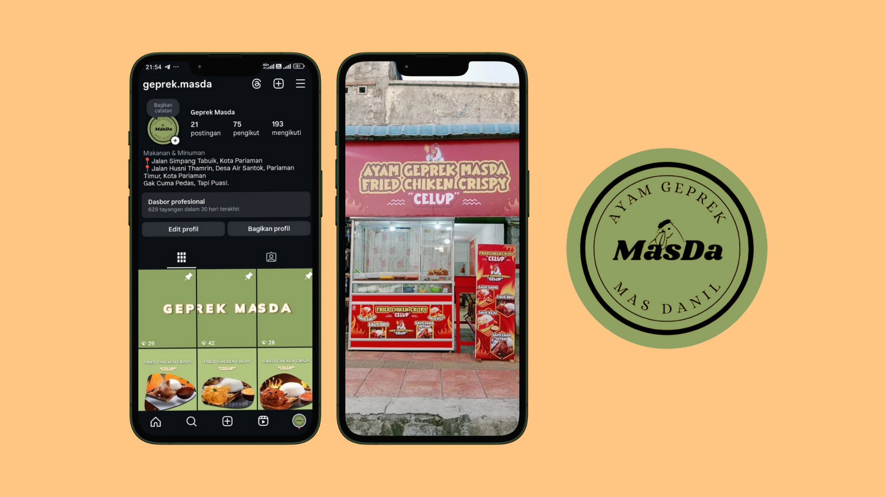

# 🍗 Ayam Geprek Masda - Food Business
#### Year Accomplished : 2023 – Present
#### Role/Position : Owner Business
#### Publication Link : [View Instagram Account](https://www.instagram.com/geprek.masda/) | [View Design Feed](https://www.figma.com/design/ESOh5Ezo914vj0LCVR9MYB/Design-Feed-Ig-Geprek?node-id=0-1&t=oug7JCf7JuwG7yIq-1)
> Other Instagram feed designs can be seen in the assets folder
#### Project Description
I developed a food business specializing in selling ayam geprek (smashed crispy chicken). I built this business together with my brother, where I was responsible for pricing strategies and social media promotions, particularly through Instagram, while my brother was in charge of food preparation and kitchen operations.

This business has been running for two years. Initially, we sold only 32 pieces of chicken per day, and now we have grown to approximately 100 pieces per day. In April, we introduced a new menu item: crispy chicken dipped in sauce, available in five sauce variations. The introduction of this new menu successfully increased our sales by 20% compared to the previous period.

# Documentation

